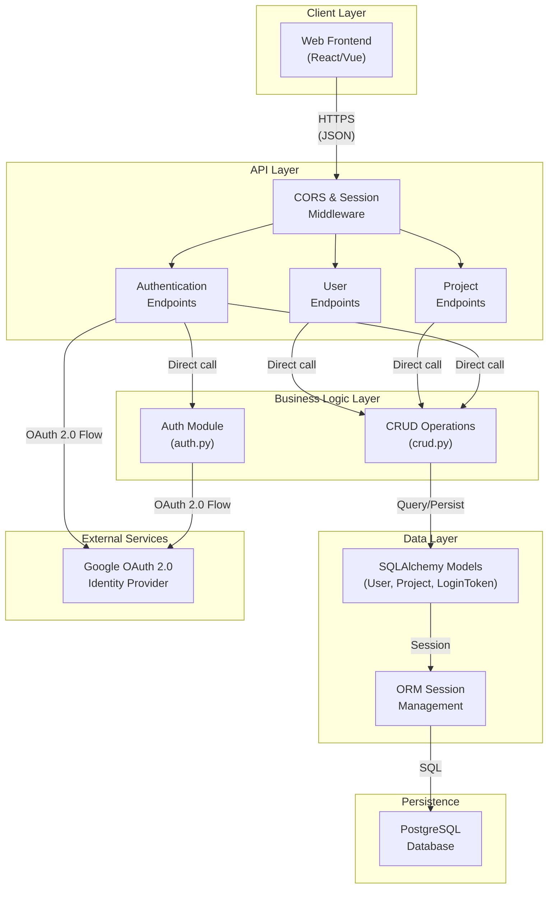

# High-Level Design (HLD)
## hackbca-example-backend

**Last Updated:** 2026-09-14  
**Document Owner:** Architecture  
**Repository:** AryanBhanushali/hackbca-example-backend

---

## Executive Overview

The hackbca-example-backend is a FastAPI-based REST API for managing projects and user authentication. It integrates with Google OAuth 2.0 for single sign-on and persists data to a PostgreSQL database. The application demonstrates a layered architecture separating API routes, business logic (CRUD), data models, and database access.

---

## Objective

Provide a scalable, secure API backend that:
- Authenticates users via Google OAuth 2.0
- Manages project lifecycle (create, read, update, delete)
- Associates users with projects through many-to-many relationships
- Exposes RESTful endpoints for a web frontend

---

## Architecture Description



### Layered Architecture

| Layer | Components | Responsibility |
|-------|------------|-----------------|
| **Client** | Web Frontend | UI/UX, initiates requests |
| **API** | FastAPI app, routes, middleware | HTTP request routing, CORS, session management |
| **Logic** | CRUD functions, auth module | Business rules, token generation, project operations |
| **Data** | SQLAlchemy ORM, models | Schema definition, ORM mapping |
| **Persistence** | PostgreSQL | Durable storage |

---

## Core Workflows

### 1. User Authentication via Google OAuth 2.0

```
Client → GET /login/google?redirect=<path>
  ↓
API stores redirect in session
  ↓
API redirects to Google authorization endpoint
  ↓
Google returns authorization code
  ↓
Client follows callback: GET /auth/google?code=<code>
  ↓
API exchanges code for ID token (via Authlib)
  ↓
API extracts Google subject and email from ID token
  ↓
API creates or retrieves User record
  ↓
API generates LoginToken
  ↓
API sets HTTPOnly cookie or returns token
  ↓
Client is redirected to original path with authentication
```

### 2. Project Creation

```
Client → POST /projects (authenticated, with ProjectIn payload)
  ↓
API verifies token via Depends(auth)
  ↓
CRUD unpacks ProjectIn and appends current user ID to users list
  ↓
CRUD queries User records for all specified UUIDs
  ↓
CRUD creates Project ORM object and persists to DB
  ↓
API returns Project object with full User details
```

### 3. Project Update (Authorization Check)

```
Client → PUT /projects/{uuid} (authenticated, with ProjectIn payload)
  ↓
API verifies token
  ↓
API checks: is current user in project.users?
  ↓
If NO → return 403 Forbidden
If YES → CRUD updates Project and returns updated object
```

---

## Data Flow

### Authentication Token Flow
- **Source:** Google OAuth 2.0 ID token
- **Transit:** Encrypted over HTTPS, stored in LoginToken table
- **Storage:** PostgreSQL `login_tokens` table (UUID, user_id)
- **Retrieval:** Verified via Depends(auth) on protected endpoints
- **Lifecycle:** Created on successful OAuth authorization, deleted on logout

### Project Data Flow
- **Creation:** ProjectIn schema → CRUD unpacking → SQLAlchemy model → PostgreSQL
- **Read:** Database query via CRUD → SQLAlchemy ORM → Pydantic schema → JSON response
- **Update:** Partial object mutation → CRUD validation → ORM commit → response
- **Deletion:** Logical delete from database (via SQLAlchemy cascade rules)

### User-Project Association
- **Many-to-Many:** Implemented via `user_project_xref` join table
- **Storage:** UUID pairs (user_id, project_id) with composite primary key
- **Access:** Loaded via SQLAlchemy lazy relationship when Project is queried

---

## Key Features

1. **Google OAuth 2.0 Integration**
   - Passwordless authentication using Google accounts
   - Automatic user creation on first login
   - Token-based session management

2. **Project Management**
   - Create, read, update, delete projects
   - Assign multiple users per project
   - Support for project metadata (name, description, github repo, URL, type)

3. **Role-Based Authorization**
   - Only project members can modify/delete projects
   - Unauthenticated access allowed for GET /projects and GET /users

4. **Session Management**
   - Cookie-based and header-based token acceptance
   - Automatic cleanup on logout

---

## Infrastructure & Deployment Overview

### Technology Stack
- **Runtime:** Python 3.x
- **Framework:** FastAPI
- **ORM:** SQLAlchemy (version configured in alembic.ini)
- **Database:** PostgreSQL
- **Auth:** Authlib (OAuth 2.0 client)
- **Middleware:** Starlette (CORSMiddleware, SessionMiddleware)

### Deployment Artifacts
- **Alembic Setup:** Present (alembic.ini configured) for database migrations
- **Dockerization:** Not determined from repository
- **CI/CD Pipeline:** Not determined from repository

---

## Deployment Strategy

Not fully determined from repository. The presence of alembic.ini suggests:
- Database migrations are version-controlled
- Deployment process likely includes running `alembic upgrade head`

**Recommended:**
- Container-based deployment (Docker)
- Environment variable injection for secrets
- Rolling deployments with zero-downtime database migration strategy

---

## Data Protection

### In Transit
- **Protocol:** HTTPS (enforced client-side)
- **Session Data:** Encrypted via SessionMiddleware secret_key
- **Tokens:** Passed as HTTP-only cookies or Authorization headers

### At Rest
- **Database Encryption:** Not determined from repository
- **User Data:** Stored plaintext in PostgreSQL (email, google_subject)
- **Tokens:** Stored as UUIDs (no sensitive material in tokens themselves)

### Secrets Management
- **Google OAuth Credentials:** Loaded from environment variables
  - `GOOGLE_CLIENT_ID`
  - `GOOGLE_CLIENT_SECRET`
  - `GOOGLE_REDIRECT_URI`
- **Database URL:** `DATABASE_URL` env var
- **Session Secret:** `SESSION_SECRET` env var
- **Token Cookie Name:** `TOKEN_NAME` env var (default: `hackbca_token`)

### Data Sharing
- **Third-party APIs:** Google OAuth 2.0 only (identity verification)
- **No LLM/Analytics integration detected**

### Logging & Retention
- **Application Logging:** Not determined from repository
- **Audit Logging:** Not determined from repository
- **Data Retention Policy:** Not determined from repository

### Security Flags
⚠️ **MANUAL REVIEW REQUIRED:**
- CORS allows credentials from all origins: `allow_credentials="*"` (main.py:23) — should restrict to known frontend domains
- TOKEN_NAME stored in plaintext if .env is committed — verify .gitignore excludes .env
- No rate limiting observed on authentication endpoints
- Google token parsing happens without explicit validation of issuer — verify Authlib validates `iss` claim

---

## Security Requirements

### Authentication Model
- **Primary:** Google OAuth 2.0 OpenID Connect (delegated identity)
- **Session:** Token-based (LoginToken)
- **Transport:** HTTPS (assumed)

### Authorization Model
- **Project CRUD:** User must be member of project (checked in main.py:118, 131)
- **User Listing:** Public (no auth required)
- **Project Listing:** Public (no auth required)

### Threat Considerations
| Threat | Mitigation | Status |
|--------|-----------|--------|
| CSRF attacks | SessionMiddleware, SameSite cookie handling | Implemented |
| SQL injection | SQLAlchemy ORM parameterized queries | Implemented |
| Brute-force auth | No rate limiting present | ⚠️ Gap |
| Token theft | HTTPS + HTTPOnly cookies recommended | Partial |
| Cross-site scripting (XSS) | Frontend responsibility; API returns JSON | Design-level |
| Unauthorized project access | Permission check on PUT/DELETE | Implemented |

### Dependency Posture
- **Critical Dependencies:**
  - FastAPI (latest/pinned version not determined)
  - SQLAlchemy (version not pinned in code)
  - Authlib (OAuth library — must be kept current)
- **Recommendation:** Implement dependency scanning (e.g., Dependabot) and regular updates

---

## Integrations

### Google OAuth 2.0
- **Purpose:** User identity and email verification
- **Authentication:** Client credentials (client_id, client_secret)
- **Data Exchanged:** Email, Google subject identifier
- **Endpoint:** `https://accounts.google.com/.well-known/openid-configuration`
- **Scope:** `openid email profile`
- **Error Handling:** Falls back to user creation on first login

---

## Environment Variables & Secrets Inventory

| Variable | Purpose | Source |
|----------|---------|--------|
| `DATABASE_URL` | PostgreSQL connection string | settings.py:6 |
| `GOOGLE_CLIENT_ID` | Google OAuth client ID | settings.py:8, auth.py:9 |
| `GOOGLE_CLIENT_SECRET` | Google OAuth client secret | settings.py:9, auth.py:10 |
| `GOOGLE_REDIRECT_URI` | OAuth callback URL (e.g., `http://localhost:8000/auth/google`) | settings.py:10, auth.py:11 |
| `FRONTEND_URL` | Frontend origin (CORS, redirects) | settings.py:12 (default: `http://localhost:3000`) |
| `SESSION_SECRET` | Starlette SessionMiddleware secret | settings.py:14 (default: `"secret"`) |
| `TOKEN_NAME` | HTTP cookie name for auth token | settings.py:15 (default: `hackbca_token`) |

**Never commit real values.** Provide `.env.example` with placeholder values for each.

---

## Change Log

### 2026-09-14 (Initial)
- **HLD created** from codebase analysis
- **Scope:** FastAPI backend, PostgreSQL ORM, Google OAuth 2.0 integration
- **Identified gaps:** No documentation on deployment, logging, rate limiting; CORS credential handling needs review
